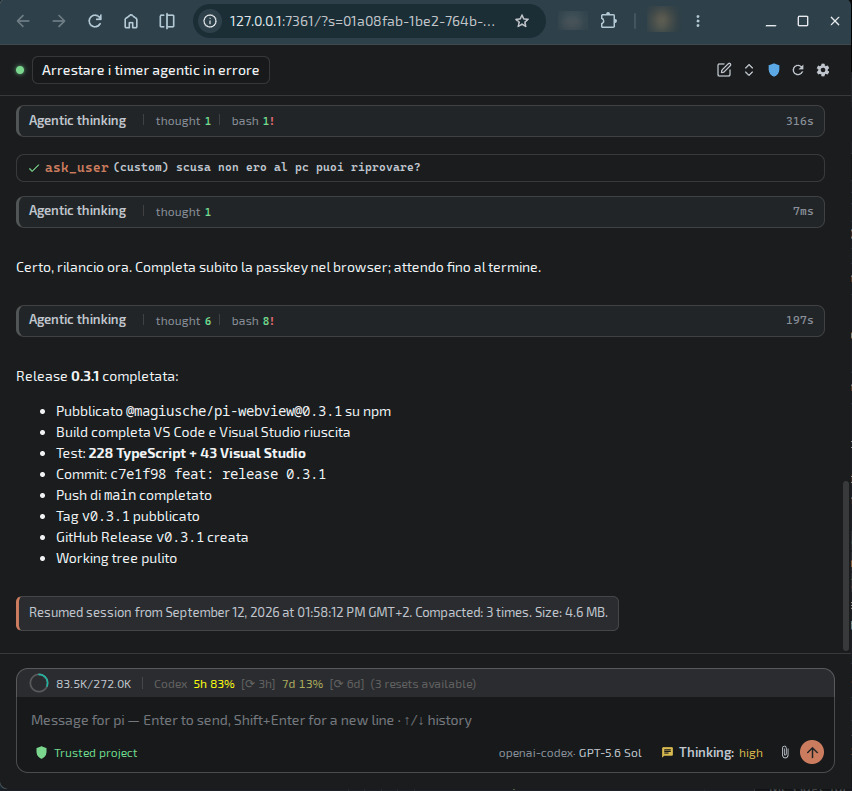

# pi-webview

A rich WebView UI for [pi](https://pi.dev), the coding agent — a modern alternative to running pi in a terminal. Built as a framework-agnostic web app, it works **standalone in the browser** and inside supported **IDE webviews** with the same codebase.





## Why

The terminal TUI of pi limits interaction: no rich markdown, no proper mouse/text selection, no images, no custom widgets. pi-webview replaces it with a DOM-based chat interface while keeping pi headless behind the scenes (`pi --mode rpc`).

## Status — experimental

> ⚠️ **Experimental.** pi-webview is a working prototype, actively developed on Linux. Things can break, change or disappear. Use it for exploration, not production.

### Implemented IDE companions

- **VS Code**
- **Visual Studio 2022**
- **Visual Studio 2026**
- **Google Chrome** — Side Panel companion; Chrome Web Store publication pending

### What works today

- **Shared chat UI**: streaming markdown, thinking with elapsed time, collapsible tool cards, copy actions and smart auto-scroll in the browser and supported IDEs
- **Optional Agentic thinking view**: groups consecutive thoughts and tool calls, reports live `thought`, `read`, `write`, `bash` and `tools` counters, avoids empty assistant wrappers, and starts a fresh block after visible text, `ask_user`, compaction or an injected steering message
- **Final tool outputs**: when an agent run ends on tool results without a later visible assistant response, the final tool batch becomes the chat response outside the Agentic block. Text, JSON, fenced code, images, files, audio/video and resource links use type-aware renderers, with the same result after resume
- **IDE and browser integration**: the same UI in **VS Code**, **Visual Studio 2022/2026** and a **Chrome Side Panel**. Chrome shows the active page’s favicon/title/URL and selection, can atomically move an existing standalone session into the panel, and exposes consent-gated DOM and viewport-screenshot tools to the agent
- **Sessions**: folder filtering, switching, forking across workspaces, renaming, deletion and creation, with an immediate full-UI loading lock during transitions; resume summaries include activity, compactions and session-file size
- **Browser-safe attachments**: paste, drag and drop, and a paperclip picker. Standalone selection happens on the browser device, then uploads the bytes to the bridge instead of browsing the bridge host filesystem
- **Header operations**: host-level pi reload, an always-visible live update shield, session controls and connection state
- **Extension UI**: `setStatus`/`setWidget` output rendered live; status placement, compactness and hidden sources are configurable
- **Themes and localization**: light/dark/system themes and Italian/English UI
- **Version reminders**: the first start after an install or update lists every available mode, includes the permanent Chrome Web Store URL and shows localized notes from the bundled changelog
- **pi.dev controls**: staged settings and dynamic per-session CLI flags, applied through transparent pi restarts
- **RPC safety**: supported built-in slash commands are handled by the client so terminal-only commands cannot leak into model prompts
- **Extensibility base**: `pi --mode rpc` bridge and a transport-agnostic UI using WebSocket, VS Code `postMessage` or Visual Studio WebView2

### Roadmap

- **`ui.custom` in RPC mode** (pi.dev core change, tracked in `docs/issues/pi-core/`, e.g. `ui-custom-rpc-not-supported.md` and `hasui-in-rpc-mode.md`): the interactive extension commands that rely on `ui.custom` need it to be supported over RPC; meanwhile they are being built as native webview UI (`docs/commands-todo.md`)
- **Extension UI protocol — remaining**: editor dialogs, notifications parity, lazy header/footer for extension UI (some require a small patch to the pi core — concept `docs/concept/0003`)
- **Code highlighting** in markdown blocks, better diffs
- **CI / test matrix** on Linux/macOS/Windows (VSIX build and release pipeline already in place: `pnpm release`)
- **More locales**, the Firefox companion after Chrome Web Store publication, and more IDE adapters

## Architecture

```
┌─ UI (pure web app) ──────────────────────────────┐
│ chat, composer, sessions, attachments, settings  │
│ speaks only the "IDE bridge protocol"            │
└──────────────┬───────────────────────────────────┘
               │ WebSocket (standalone) / postMessage (IDE webview)
┌──────────────▼───────────────────────────────────┐
│ Host adapter (one per environment)               │
│ standalone · Chrome · VS Code · Visual Studio    │
└──────────────┬───────────────────────────────────┘
               │ JSONL stdio
┌──────────────▼───────────────────────────────────┐
│ pi core --mode rpc (headless)                    │
└──────────────────────────────────────────────────┘
```

The bridge forwards pi JSONL frames between stdio and the authenticated WebSocket UI, while handling environment services such as sessions, configuration, attachments and trust. It is loopback-only by default; explicit IPv4 binding keeps token authentication mandatory for non-loopback clients.

## Requirements

- Node.js >= 22.6
- [pi](https://pi.dev) installed (`npm install -g --ignore-scripts @earendil-works/pi-coding-agent`)
- pnpm (enforced via `preinstall`)

> **Using the package** (install, `piw`, uninstall)? User documentation lives in
> the [npm package page](https://www.npmjs.com/package/@magiusche/pi-webview)
> (source: `packages/pi-webview/README.md`) — it is **not** duplicated here.

## Quick start

```bash
pnpm install
pnpm dev          # starts the bridge + dev server and opens the browser
```

The UI connects automatically to the bridge (same origin / auto-discovered URL). Without a running bridge, use the manual connect panel (`ws://127.0.0.1:PORT?token=…`).

To preview the UI without a model:

```bash
pnpm dev          # then open http://localhost:5173/?demo=1&theme=dark&lang=en
```

`?demo=1` renders a sample conversation; `?theme=light|dark|system` and `?lang=it|en` force theme/locale.

## Scripts

| Script                                                           | Description                                                                                                                                                                                                                                                                                                                 |
| ---------------------------------------------------------------- | --------------------------------------------------------------------------------------------------------------------------------------------------------------------------------------------------------------------------------------------------------------------------------------------------------------------------- |
| `pnpm dev`                                                       | Full dev: bridge (`--debug`) + Vite (HMR) + browser                                                                                                                                                                                                                                                                         |
| `pnpm dev:bridge`                                                | Bridge only, in watch mode                                                                                                                                                                                                                                                                                                  |
| `pnpm dev:web`                                                   | Vite dev server only                                                                                                                                                                                                                                                                                                        |
| `pnpm build`                                                     | Build the UI → `dist/web`                                                                                                                                                                                                                                                                                                   |
| `pnpm start`                                                     | Standalone use: build + bridge serving `dist/web`                                                                                                                                                                                                                                                                           |
| `pnpm test`                                                      | Unit tests (`node --test`, native TS)                                                                                                                                                                                                                                                                                       |
| `pnpm test:watch`                                                | Tests in watch mode                                                                                                                                                                                                                                                                                                         |
| `pnpm smoke`                                                     | Bridge smoke test against a real pi (no LLM)                                                                                                                                                                                                                                                                                |
| `pnpm smoke:chrome`                                              | Build and validate the Chrome package; also exercise the Side Panel when the installed Chrome build permits command-line extension loading                                                                                                                                                                                  |
| `pnpm format` / `pnpm format:check`                              | Prettier                                                                                                                                                                                                                                                                                                                    |
| `pnpm typecheck`                                                 | `tsc --noEmit`                                                                                                                                                                                                                                                                                                              |
| `pnpm compile`                                                   | Build UI + VS Code adapter (for F5)                                                                                                                                                                                                                                                                                         |
| `pnpm package:vscode`                                            | Build the VS Code companion → `dist/pi-webview-ide.vsix`                                                                                                                                                                                                                                                                    |
| `pnpm package:visualstudio`                                      | Build the Visual Studio companion → `dist/pi-webview-visualstudio.vsix` (Linux: requires `node tools/setup-vs-wine.mjs` once — project-local wine prefix + VSSDK cache patches)                                                                                                                                             |
| `pnpm package:chrome`                                            | Build the Chrome companion → `dist/pi-webview-chrome/` and `dist/pi-webview-chrome.zip`                                                                                                                                                                                                                                     |
| `pnpm package:pi`                                                | Assemble the pi package (`packages/pi-webview/`, VSIXes and Chrome companion included)                                                                                                                                                                                                                                      |
| `pnpm release -- --version 0.1.1 [--publish] [--tag <dist-tag>]` | Release prep: bump versione in entrambi i package.json, rebuild vsix+bundle+UI, `npm pack` di verifica. Con `--publish` esegue anche `npm publish --access public` e crea automaticamente il tag git `v<version>` + la GitHub release (idempotente: skip se tag/release già esistenti). Senza `--publish` non pubblica mai. |

## Companion integration

The IDE integration is distributed as a **pi package** (installed through pi's own
extension system, not the VS Code marketplace). The companion extensions are
ensured **at every pi start**: the pi-side extension installs/updates the **VS
Code companion** from the bundled VSIX if missing or outdated (idempotent,
silent when `code` is not on `PATH`, disable with `PI_WEBVIEW_AUTO_INSTALL=0`),
and the **Visual Studio companion** (Windows only) via vswhere + VSIXInstaller
when VS is present. The package also includes the **Chrome Side Panel** bundle;
the explicit `/piw install` flow opens the Web Store listing when its permanent
ID is configured, or Chrome’s guided Load unpacked flow during development.
`piw` runs the same centralized companion check (one shared module,
`src/bridge/companions.ts`) at its startup. The same
pi-side extension creates the `piw` link on the PATH (the package has no install
scripts).

> For user-facing instructions (install, `/piw` subcommands, uninstall)
> see the [npm package page](https://www.npmjs.com/package/@magiusche/pi-webview).

> **Note:** the repo does **not** track build artifacts (`*.vsix`, `dist/`):
> `pnpm package:pi` is **required** before `pi install` from a fresh clone,
> and after changing the companion or the pi-side extension code.

The companions create the webview, spawn `pi --mode rpc` and bridge the UI via
`postMessage` (VS Code) or `window.chrome.webview` (Visual Studio WebView2, same
UI and protocol as standalone; editor selection flows directly to the webview).
The Visual Studio adapter is a native C# VSIX (`src/adapters/visualstudio/`, see
`docs/plans/0006-visual-studio-adapter.md`); on Linux it builds through a
project-local wine toolchain (`tools/setup-vs-wine.mjs`).

To develop the companion directly, use **F5** (`launch.json` runs the Extension
Development Host after `pnpm compile`).

## Configuration

User config lives in the OS user config directory:

- Linux: `~/.config/pi-webview/config.json`
- macOS: `~/Library/Application Support/pi-webview/config.json`
- Windows: `%APPDATA%\pi-webview\config.json`

It stores global presentation preferences: theme, locale, history limit, notification default, status-bar placement and compactness, hidden status sources, and the optional Agentic thinking mode. Per-session CLI flags and notification overrides remain session data rather than global configuration.

## Project structure

```
src/
  adapters/   # VS Code, Visual Studio and browser companions
  ide/        # shared protocol: IDE bridge, RPC helpers, events mapping
  bridge/     # standalone Node bridge (pi spawn, WS, sessions, trust, attachments)
  web/        # the UI (vanilla TS): chat, markdown, i18n, theme, icons
tests/        # unit tests (node --test, no tsx)
tools/        # dev tooling (dev runner, smoke test, package-manager check)
docs/
  concept/    # architecture decisions (numbered)
  plans/      # implementation plans (numbered)
```

## Cross-platform

Development is done on Linux, but the deploy targets **Linux, macOS and Windows**: pi is an npm package on all three. On Windows, pi itself resolves the shell used by its default `bash` tool; pi-webview does not duplicate that check. The bridge resolves the `pi` binary (`.cmd` shim on Windows), uses `os.tmpdir()`/`path.join` and never hard-codes unix paths.

## License

MIT
