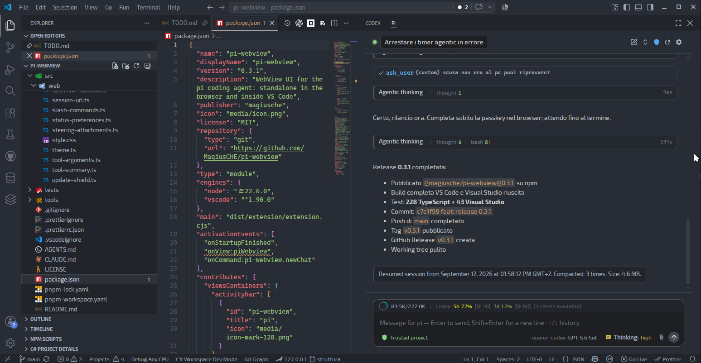
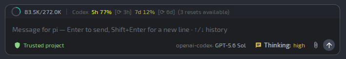

# pi-webview

A rich WebView UI for [pi](https://pi.dev), the coding agent — a modern alternative to running pi in a terminal. Built as a framework-agnostic web app, it works **standalone in the browser** and inside an **IDE webview** (VS Code adapter included) with the same codebase.






## Why

The terminal TUI of pi limits interaction: no rich markdown, no proper mouse/text selection, no images, no custom widgets. pi-webview replaces it with a DOM-based chat interface while keeping pi headless behind the scenes (`pi --mode rpc`).

## Status — experimental

> ⚠️ **Experimental.** pi-webview is a working prototype, actively developed on Linux. Things can break, change or disappear. Use it for exploration, not production.

### What works today

- **Chat in the browser** (standalone): streaming markdown, thinking blocks with elapsed seconds, collapsible tool cards with command summaries, copy buttons, smart auto-scroll
- **IDE integration (VS Code)**: the same UI inside a VS Code webview, with editor selection context; native dialogs (`select`/`confirm`/`input` via `showQuickPick`/`showWarningMessage`/`showInputBox`); distributed as a pi package with companion auto-install. Editor selection works only in the **sidebar view** (inhibited in editor-area panels, where focus would clear it)
- **Sessions**: dropdown with current folder (`./…`) / All filter, switch, **fork of sessions from other folders** (same behavior as pi), new session
- **Composer controls**: model picker, thinking level, project **trust** (writes `~/.pi/agent/trust.json`, with confirmation for full access)
- **Attachments**: paste and drag & drop of files and images — previews in chat; images sent inline when the model supports vision, otherwise as file paths
- **Extension UI**: status and widget areas set by pi extensions (`setStatus`/`setWidget` via `extension_ui_request`) rendered live in the chat footer (see screenshot above)
- **Themes** (light/dark/system) and **i18n** (it/en), settings modal
- **pi.dev CLI flags in settings** — dynamic per-session launch flags (e.g. `--session-control`), applied via a transparent pi restart, stored in the session file
- **Extensibility base**: `pi --mode rpc` bridge, transport-agnostic UI (WebSocket standalone, `postMessage` in the IDE webview)

### Roadmap

- **`ui.custom` in RPC mode** (pi.dev core change, tracked in `docs/issues/pi-core/`, e.g. `ui-custom-rpc-not-supported.md` and `hasui-in-rpc-mode.md`): the interactive extension commands that rely on `ui.custom` need it to be supported over RPC; meanwhile they are being built as native webview UI (`docs/commands-todo.md`)
- **Extension UI protocol — remaining**: editor dialogs, notifications parity, lazy header/footer for extension UI (some require a small patch to the pi core — concept `docs/concept/0003`)
- **Code highlighting** in markdown blocks, better diffs
- **CI / test matrix** on Linux/macOS/Windows (VSIX build and release pipeline already in place: `pnpm release`)
- **More locales** and more IDE adapters (e.g. open the bridge in a browser from JetBrains)

## Features

- **Full chat UI** — streaming markdown (`marked` + `DOMPurify`), thinking blocks with spinner + elapsed seconds, collapsible tool cards with command summaries, copy buttons on code blocks
- **Standalone & IDE-ready** — a Node bridge spawns `pi --mode rpc` and exposes it over a local WebSocket; the same UI runs inside the VS Code webview via `postMessage` (transport-agnostic)
- **Session management** — dropdown with the current session (first message / name, message count, relative age), folder filter (`./project` / All), session switching, fork of sessions from other folders (same behavior as pi), new session
- **Model & controls in the composer** — switch model (list from pi), thinking level, project trust level (writes `~/.pi/agent/trust.json`, with confirmation for full access)
- **Attachments** — paste or drag & drop files and images: previews in the composer and in chat; images sent inline when the model supports vision, otherwise as file paths (vision detected from the model's capabilities)
- **Themes** — light / dark / system (default), following the OS and derived from `--vscode-*` tokens when in an IDE webview
- **i18n** — Italian and English (pattern: JSON per language, browser locale detection, saved preference)

## Architecture

```
┌─ UI (pure web app) ──────────────────────────────┐
│ chat, composer, sessions, attachments, settings  │
│ speaks only the "IDE bridge protocol"            │
└──────────────┬───────────────────────────────────┘
               │ WebSocket (standalone) / postMessage (IDE webview)
┌──────────────▼───────────────────────────────────┐
│ Host adapter (one per environment)               │
│ standalone bridge · VS Code · others (future)    │
└──────────────┬───────────────────────────────────┘
               │ JSONL stdio
┌──────────────▼───────────────────────────────────┐
│ pi core --mode rpc (headless)                    │
└──────────────────────────────────────────────────┘
```

The bridge does **not** interpret messages: it forwards JSONL frames between pi (stdio) and the UI (WebSocket, loopback + auth token). This mirrors the lock-file pattern of the "Pi x IDE" extension.

## Requirements

- Node.js >= 22.6
- [pi](https://pi.dev) installed (`npm install -g --ignore-scripts @earendil-works/pi-coding-agent`)
- pnpm (enforced via `preinstall`)

> **Using the package** (install, `piw`, uninstall)? User documentation lives in
> the [npm package page](https://www.npmjs.com/package/@magiusche/pi-webview)
> (source: `packages/pi-webview/README.md`) — it is **not** duplicated here.

## Quick start

```bash
pnpm install
pnpm dev          # starts the bridge + dev server and opens the browser
```

The UI connects automatically to the bridge (same origin / auto-discovered URL). Without a running bridge, use the manual connect panel (`ws://127.0.0.1:PORT?token=…`).

To preview the UI without a model:

```bash
pnpm dev          # then open http://localhost:5173/?demo=1&theme=dark&lang=en
```

`?demo=1` renders a sample conversation; `?theme=light|dark|system` and `?lang=it|en` force theme/locale.

## Scripts

| Script                              | Description                                              |
| ----------------------------------- | -------------------------------------------------------- |
| `pnpm dev`                          | Full dev: bridge (`--debug`) + Vite (HMR) + browser      |
| `pnpm dev:bridge`                   | Bridge only, in watch mode                               |
| `pnpm dev:web`                      | Vite dev server only                                     |
| `pnpm build`                        | Build the UI → `dist/web`                                |
| `pnpm start`                        | Standalone use: build + bridge serving `dist/web`        |
| `pnpm test`                         | Unit tests (`node --test`, native TS)                    |
| `pnpm test:watch`                   | Tests in watch mode                                      |
| `pnpm smoke`                        | Bridge smoke test against a real pi (no LLM)             |
| `pnpm format` / `pnpm format:check` | Prettier                                                 |
| `pnpm typecheck`                    | `tsc --noEmit`                                           |
| `pnpm compile`                      | Build UI + VS Code adapter (for F5)                      |
| `pnpm package:vscode`               | Build the VS Code companion → `dist/pi-webview-ide.vsix` |
| `pnpm package:visualstudio`          | Build the Visual Studio companion → `dist/pi-webview-visualstudio.vsix` (Linux: requires `node tools/setup-vs-wine.mjs` once — project-local wine prefix + VSSDK cache patches) |
| `pnpm package:pi`                    | Assemble the pi package (`packages/pi-webview/`, both vsix included)         |
| `pnpm release -- --version 0.1.1 [--publish] [--tag <dist-tag>]` | Release prep: bump versione in entrambi i package.json, rebuild vsix+bundle+UI, `npm pack` di verifica. Con `--publish` esegue anche `npm publish --access public` e crea automaticamente il tag git `v<version>` + la GitHub release (idempotente: skip se tag/release già esistenti). Senza `--publish` non pubblica mai. |

## IDE integration (VS Code first, Visual Studio too)

The IDE integration is distributed as a **pi package** (installed through pi's own
extension system, not the VS Code marketplace). The companion extensions are
ensured **at every pi start**: the pi-side extension installs/updates the **VS
Code companion** from the bundled VSIX if missing or outdated (idempotent,
silent when `code` is not on `PATH`, disable with `PI_WEBVIEW_AUTO_INSTALL=0`),
and the **Visual Studio companion** (Windows only) via vswhere + VSIXInstaller
when VS is present; `piw` repeats the VS Code check at its startup. The same
pi-side extension creates the `piw` link on the PATH (the package has no install
scripts).

> For user-facing instructions (install, `/pi-webview` subcommands, uninstall)
> see the [npm package page](https://www.npmjs.com/package/@magiusche/pi-webview).

> **Note:** the repo does **not** track build artifacts (`*.vsix`, `dist/`):
> `pnpm package:pi` is **required** before `pi install` from a fresh clone,
> and after changing the companion or the pi-side extension code.

The companions create the webview, spawn `pi --mode rpc` and bridge the UI via
`postMessage` (VS Code) or `window.chrome.webview` (Visual Studio WebView2, same
UI and protocol as standalone; editor selection flows directly to the webview).
The Visual Studio adapter is a native C# VSIX (`src/adapters/visualstudio/`, see
`docs/plans/0006-visual-studio-adapter.md`); on Linux it builds through a
project-local wine toolchain (`tools/setup-vs-wine.mjs`).

To develop the companion directly, use **F5** (`launch.json` runs the Extension
Development Host after `pnpm compile`).

## Configuration

User config lives in the OS user config directory:

- Linux: `~/.config/pi-webview/config.json`
- macOS: `~/Library/Application Support/pi-webview/config.json`
- Windows: `%APPDATA%\pi-webview\config.json`

Currently stores the theme preference and the history limit; future settings will be added there.

## Project structure

```
src/
  ide/        # shared protocol: IDE bridge, RPC helpers, events mapping
  bridge/     # standalone Node bridge (pi spawn, WS, sessions, trust, attachments)
  web/        # the UI (vanilla TS): chat, markdown, i18n, theme, icons
tests/        # unit tests (node --test, no tsx)
tools/        # dev tooling (dev runner, smoke test, package-manager check)
docs/
  concept/    # architecture decisions (numbered)
  plans/      # implementation plans (numbered)
```

## Cross-platform

Development is done on Linux, but the deploy targets **Linux, macOS and Windows**: pi is an npm package on all three (Windows requires a bash shell, e.g. Git Bash — a requirement of pi itself). The bridge resolves the `pi` binary (`.cmd` shim on Windows), uses `os.tmpdir()`/`path.join` and never hard-codes unix paths.

## License

MIT
